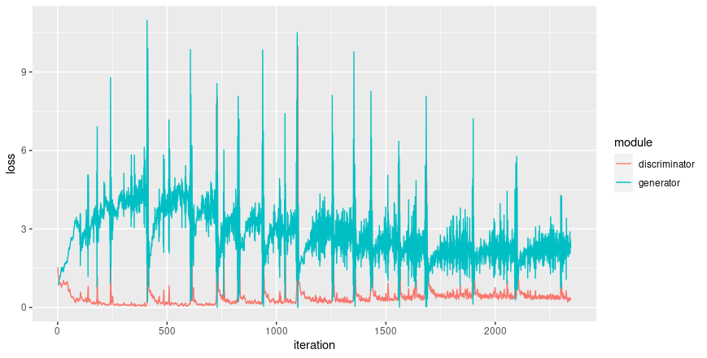

# Generative adversarial networks {#gans}

*Generative Adversarial Networks* (GANs) are one of the most successful, as of this writing, unsupervised (or self-supervised,
rather) deep learning architectures . In GANs, there is no well-defined loss function; instead, the setup is fundamentally
game-theoretic: Two actors, the *generator* and the *discriminator*, each try to minimize their loss; the outcome should be
some artifact -- image, text, what have you -- that resembles the training data but does not copy them.

In theory, this is a highly fascinating approach; in practice, it can be a challenge to set parameters in a way that good
results are achieved. The architecture and settings presented here follow those reported in the original DCGAN article
[@goodfellow2014generative]. In the meantime, a lot of research has been done; minor changes to loss functions, optimizers
and/or parameters may make an important difference.

## Dataset

For this task, we use [Kuzushiji-MNIST](https://github.com/rois-codh/kmnist) [@clanuwat2018deep], one of the more recent MNIST
drop-ins. Kuzushiji-MNIST contains 70,000 grayscale images, of size 28x28 px just like MNIST, and also like MNIST, divided
into 10 classes.

We can use `torch` for loading it. With an unsupervised learning task such as this one, we only need the training set:

```{r}
library(torch)

batch_size <- 128

kmnist <- kmnist_dataset(
    dir,
    download = TRUE,
    transform = function(x) {
        x <- x$to(dtype = torch_float())/256
        x[newaxis,..]
    }
)
dl <- dataloader(kmnist, batch_size = batch_size, shuffle = TRUE)

```

Let's view a few of those. Here are the initial 16 images, taken from the very first batch:

```{r, fig.asp=1, fig.width=8}
images <- dl$.iter()$.next()[[1]][1:16, 1, , ] 
images <- normalize(images) %>% as_array()
images %>%
  purrr::array_tree(1) %>%
  purrr::map(as.raster) %>%
  purrr::iwalk(~{plot(.x)})
```

```{r}
knitr::include_graphics("images/gan_real.png")
```

## Model

The model, in the abstract sense, consists of the interplay of two models, in the concrete sense -- two `torch` *modules*. The
*generator* produces fake artifacts -- fake Kuzushiji digits, in our case -- in the hope of getting better and better at it;
the *discriminator* is tasked with telling actual from fake images. (Its task should, if all goes well, get more difficult
over time.)

Let's start with the generator.

### Generator

The generator is given a random noise vector (1d), and has to produce images (2d, of a given resolution). Its main mode of
action is repeated application of *transposed convolutions* that upsample from a resolution of `1x1` to the required
resolution of `28x28`.

Following the DCGAN paper, the generator's `nn_conv_transpose2d` and `nn_batch_norm2d` layers are initialized according to a
normal distribution with mean 0 and standard deviation 0.02.

```{r}
device <- if (cuda_is_available()) torch_device("cuda:0") else "cpu"

latent_input_size <- 100
image_size <- 28

generator <- nn_module(
    "generator",
    initialize = function() {
        self$main = nn_sequential(
            # nn_conv_transpose2d(in_channels, out_channels, kernel_size, stride=1, padding=0, output_padding=0, groups=1, bias=TRUE, dilation=1, padding_mode='zeros')
            # h_out = (h_in - 1) * stride - 2 * padding + dilation * (kernel_size - 1) + output_padding + 1
            # (1 - 1) * 1 - 2 * 0 + 1 * (4 -1 ) + 0 + 1
            # 4 x 4
            nn_conv_transpose2d(latent_input_size, image_size * 4, 4, 1, 0, bias = FALSE),
            nn_batch_norm2d(image_size * 4),
            nn_relu(),
            # 8 * 8
            nn_conv_transpose2d(image_size * 4, image_size * 2, 4, 2, 1, bias = FALSE),
            nn_batch_norm2d(image_size * 2),
            nn_relu(),
            # 16 x 16
            nn_conv_transpose2d(image_size * 2, image_size, 4, 2, 2, bias = FALSE),
            nn_batch_norm2d(image_size),
            nn_relu(),
            # 28 x 28
            nn_conv_transpose2d(image_size, 1, 4, 2, 1, bias = FALSE),
            nn_tanh()
        )
    },
    forward = function(x) {
        self$main(x)
    }
)

gen <- generator()

init_weights <- function(m) {
    if (grepl("conv", m$.classes[[1]])) {
        nn_init_normal_(m$weight$data(), 0.0, 0.02)
    } else if (grepl("batch_norm", m$.classes[[1]])) {
        nn_init_normal_(m$weight$data(), 1.0, 0.02)
        nn_init_constant_(m$bias$data(), 0)
    }
}

gen[[1]]$apply(init_weights)

disc$to(device = device)

```

### Discriminator

The discriminator is a pretty conventional convnet. Its layers' weights are initialized in the same way as the generator's.

```{r}
discriminator <- nn_module(
    "discriminator",
    initialize = function() {
        self$main = nn_sequential(
            # 14 x 14
            nn_conv2d(1, image_size, 4, 2, 1, bias = FALSE),
            nn_leaky_relu(0.2, inplace = TRUE),
            # 7 x 7
            nn_conv2d(image_size, image_size * 2, 4, 2, 1,  bias = FALSE),
            nn_batch_norm2d(image_size * 2),
            nn_leaky_relu(0.2, inplace = TRUE),
            # 3 x 3
            nn_conv2d(image_size * 2, image_size * 4, 4, 2, 1,  bias = FALSE),
            nn_batch_norm2d(image_size * 4),
            nn_leaky_relu(0.2, inplace = TRUE),
            # 1 x 1
            nn_conv2d(image_size * 4, 1, 4, 2, 1,  bias = FALSE),
            nn_sigmoid()
        )
    },
    forward = function(x) {
        self$main(x)
    }
)

disc <- discriminator()

disc[[1]]$apply(init_weights)

disc$to(device = device)

```

### Optimizers and loss function

While generator and discriminator each need to account for their own losses, mathematically both use the same calculation,
namely, binary crossentropy:

```{r}
criterion <- nn_bce_loss()
```

They each have their own optimizer:

```{r}
learning_rate <- 0.0002

disc_optimizer <- optim_adam(disc$parameters, lr = learning_rate, betas = c(0.5, 0.999))
gen_optimizer <- optim_adam(gen$parameters, lr = learning_rate, betas = c(0.5, 0.999))
```

## Training loop

Each epoch, the training loop consists of three parts.

First, the discriminator is trained. This, logically, is a two-step procedure (with no time dependencies between steps). In
step 1, it is given the real images, together with labels (fabricated on the fly) that say "these are real images". Binary
cross entropy will be minimized when all those images are, in fact, classified as real by the discriminator. In stage 2, first
the generator is asked to generate some images, and then the discriminator is asked to rate them. Again, binary cross entropy
is calculated, but this time, it will be minimal if all images are characterized as fake. Once gradients have been obtained
for both computations, the discriminator's weights are updated.

Then it's the generator's turn -- although in an indirect way. We pass the newly generated fakes to the *discriminator* again;
only this time, the desired verdict is "no fake", so the labels are set to "real". The binary cross entropy loss then reflects
the *generator's* performance, not that of the discriminator.

```{r}
fixed_noise <- torch_randn(c(64, latent_input_size, 1, 1), device = device)
num_epochs <- 5

img_list <- vector(mode = "list", length = num_epochs * trunc(dl$.iter()$.length()/50))
gen_losses <- c()
disc_losses <- c()

img_num <- 0
for (epoch in 1:num_epochs) {

    batchnum <- 0
    for (b in enumerate(dl)) {

        batchnum <- batchnum + 1

        y_real <- torch_ones(b[[1]]$size()[1], device = device)
        y_fake <- torch_zeros(b[[1]]$size()[1], device = device)

        noise <- torch_randn(b[[1]]$size()[1], latent_input_size, 1, 1, device = device)
        fake <- gen(noise)
        img <- b[[1]]$to(device = device)

        # update discriminator
        disc_loss <- criterion(disc(img), y_real) + criterion(disc(fake$detach()), y_fake)

        disc_optimizer$zero_grad()
        disc_loss$backward()
        disc_optimizer$step()

        # update generator
        gen_loss <- criterion(disc(fake), y_real)

        gen_optimizer$zero_grad()
        gen_loss$backward()
        gen_optimizer$step()

        disc_losses <- c(disc_losses, disc_loss$cpu()$item())
        gen_losses <- c(gen_losses, gen_loss$cpu()$item())

        if (batchnum %% 50 == 0) {
            img_num <- img_num + 1
            cat("Epoch: ", epoch,
                "    batch: ", batchnum,
                "    disc loss: ", as.numeric(disc_loss$cpu()),
                "    gen loss: ", as.numeric(gen_loss$cpu()),
                "\n")
            with_no_grad({
                generated <- gen(fixed_noise)
                grid <- vision_make_grid(generated)
                img_list[[img_num]] <- as_array(grid$to(device = "cpu"))
            })
        }

    }
}
```


## Artifacts

Now let's see a few samples of generated images, spread out over training time:

```{r,  fig.asp=1, fig.width=8}
index <- seq(1, length(img_list), length.out = 16)
images <- img_list[index]

par(mfrow = c(4,4), mar = rep(0.2, 4))
rasterize <- function(x) {
    as.raster(x[1, , ])
}
images %>%
    purrr::map(rasterize) %>%
    purrr::iwalk(~{plot(.x)})
```

```{r}
knitr::include_graphics("images/gan_over_time.png")
```

To my (untrained) eyes, the final results look pretty good! Let's generate a fresh batch:

```{r, fig.asp=1, fig.width=8}
new <- gen(fixed_noise)$cpu()$detach()[1:16, , , ]

new %>% normalize() %>%
  as_array() %>%
  purrr::array_tree(1) %>%
  purrr::map(rasterize) %>%
  purrr::iwalk(~{plot(.x)})
```

```{r}
# knitr::include_graphics("images/gan_over_time.png")
```

We can also inspect how the respective losses developed over time:

```{r}
library(ggplot2)
library(tidyr)

iterations <- 1:length(disc_losses)

df <- data.frame(iteration = iterations, discriminator = disc_losses, generator = gen_losses)
df %>%
  gather(module, loss, discriminator, generator) %>%
  ggplot(aes(x = iteration, y = loss, colour = module)) +
  geom_line()

```

```{r}

```
