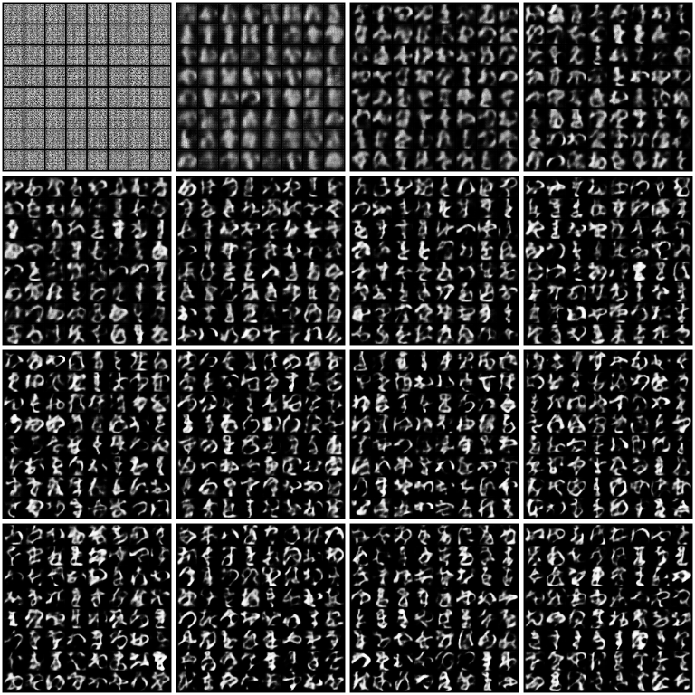

# Variational autoencoders {#vaes}

Now we look at the other -- as of this writing -- main type of architecture used for self-supervised learning: *Variational
Autoencoders* (VAEs). VAEs are autoencoders, in that they compress their input and, starting from a compressed representation,
aim for a faithful reconstruction. But in addition, there is a constraint on that compressed representation: It is regularized
so as to deviate as little as possible from a prior distribution, often (but not necessarily) a multivariate normal. The
rationale behind this regularization is that we are looking for an informative *latent space* of hidden variables, whose
expression to various degrees should create the range of "phenotypes" observed.

Thus, where GANs are designed solely for good generative performance, VAEs embody the additional aspiration to allow for a
meaningful representation of the domain modeled. Of course, what counts as a meaningful representation is open for debate.
Often in introductory articles, the latent space is chosen to consist of just two variables, which can then be drawn from at
random and passed through the decoder. In two dimensions, we can then nicely plot the artifacts in a grid, and visually try to
infer "what a dimension does". However, as soon as the domain modeled requires more than just two dimensions, the latent space
itself has to undergo dimensionality reduction in order to be plotted, resulting in loss of information and, most
problematically, ambiguity.

In our sample application, we compare, for a given dataset, modeling with latent space dimensionalities of 2 and 128,
respectively. In the former case, we also take a look at the two-dimensional grid of artifacts.

## Dataset

For comparability with the GAN model shown in the last chapter, we use the same dataset, Kuzushiji-MNIST.

```{r}
library(zeallot)

kmnist <- kmnist_dataset(
    dir,
    download = TRUE,
    transform = function(x) {
        x <- x$to(dtype = torch_float())/256
        x[newaxis,..]
    }
)
dl <- dataloader(kmnist, batch_size = 128, shuffle = TRUE)

device <- if (cuda_is_available()) torch_device("cuda:0") else "cpu"


```

## Model

This time, for illustrative purposes, we encapsulate all functionality in a custom `VAE` module comprises encoder and decoder
submodules which are called, in order, from the `forward` method. Also contained in the module are the loss function and a
utility function to sample images.

The model uses the famous *reparameterization trick* [@kingma2013autoencoding] to reduce variance during optimization. Instead
of sampling directly from the latent space, using its mean and variance, we introduce a new standard-normal random variable
$\epsilon$ and transform this into non-standard normals using the learned means and standard deviations from latent space.

```{r}
image_size <- 28

view <- nn_module(
    "View",
    initialize = function(shape) {
        self$shape <- shape
    },
    forward = function(x) {
        x$view(self$shape)
    }
)

vae <- nn_module(
    "VAE",

    initialize = function(latent_dim) {
        self$latent_dim <- latent_dim
        self$latent_mean <- nn_linear(896, latent_dim)
        self$latent_log_var <- nn_linear(896, latent_dim)

        self$encoder <- nn_sequential(
            nn_conv2d(1, image_size, kernel_size= 3, stride= 2, padding  = 1),
            nn_batch_norm2d(image_size),
            nn_leaky_relu(),
            nn_conv2d(image_size, image_size * 2, kernel_size= 3, stride= 2, padding  = 1),
            nn_batch_norm2d(image_size * 2),
            nn_leaky_relu(),
            nn_conv2d(image_size * 2, image_size * 4, kernel_size= 3, stride= 2, padding  = 1),
            nn_batch_norm2d(image_size * 4),
            nn_leaky_relu(),
            nn_conv2d(image_size * 4, image_size * 8, kernel_size= 3, stride= 2, padding  = 1),
            nn_batch_norm2d(image_size * 8),
            nn_leaky_relu()
        )

        self$decoder <- nn_sequential(
            nn_linear(latent_dim, image_size * 8),
            view(c(-1, image_size * 8, 1, 1)),
            nn_conv_transpose2d(image_size * 8, image_size * 4, kernel_size = 4, stride = 1, padding = 0, bias = FALSE),
            nn_batch_norm2d(image_size * 4),
            nn_leaky_relu(),
            # 8 * 8
            nn_conv_transpose2d(image_size * 4, image_size * 2, kernel_size = 4, stride = 2, padding = 1, bias = FALSE),
            nn_batch_norm2d(image_size * 2),
            nn_leaky_relu(),
            # 16 x 16
            nn_conv_transpose2d(image_size * 2, image_size, kernel_size = 4, stride = 2, padding = 2, bias = FALSE),
            nn_batch_norm2d(image_size),
            nn_leaky_relu(),
            # 28 x 28
            nn_conv_transpose2d(image_size, 1, kernel_size = 4, stride = 2, padding = 1, bias = FALSE),
            nn_sigmoid()
        )
    },

    encode = function(x) {
        result <- self$encoder(x) %>%
            torch_flatten(start_dim = 1)
        mean <- self$latent_mean(result)
        log_var <- self$latent_log_var(result)
        list(mean, log_var)
    },

    decode = function(z) {
        self$decoder(z)
    },

    reparameterize = function(mean, logvar) {
        std <- torch_tensor(0.5, device = "cuda") * logvar
        eps <- torch_randn_like(std)
        eps * std + mean
    },

    loss_function = function(reconstruction, input, mean, log_var) {
        reconstruction_loss <- nnf_binary_cross_entropy(reconstruction, input, reduction = "sum")
        kl_loss <- torch_tensor(-0.5, device = "cuda") * torch_sum(torch_tensor(1, device = "cuda") + log_var - mean^2 - log_var$exp())
        loss <- reconstruction_loss + kl_loss
        list(loss, reconstruction_loss, kl_loss)
    },

    forward = function(x) {
        c(mean, log_var) %<-% self$encode(x)
        z <- self$reparameterize(mean, log_var)
        list (self$decode(z), x, mean, log_var)
    },

    sample = function(num_samples, current_device) {
        z <- torch_randn(num_samples, self$latent_dim)
        z <- z$to(device = current_device)
        samples <- self$decode(z)
        samples
    }


model <- vae(latent_dim = 128)$to(device = device)

```

## Training the VAE

We train the model for 3 epochs. Training code is just a few lines, as the model itself contains all the logic.

TBD: change make\_grid and normalize once they're available.

```{r}
optimizer <- optim_adam(model$parameters, lr = 0.001)

num_epochs <- 3

img_num <- 0
for (epoch in 1:num_epochs) {

    batchnum <- 0
    for (b in enumerate(dl)) {

        batchnum <- batchnum + 1
        input <- b[[1]]$to(device = device)
        optimizer$zero_grad()
        c(reconstruction, input, mean, log_var) %<-% model(input)
        c(loss, reconstruction_loss, kl_loss) %<-% model$loss_function(reconstruction, input, mean, log_var)

        if(batchnum %% 50 == 0) {
            img_num <- img_num + 1
            cat("Epoch: ", epoch,
                "    batch: ", batchnum,
                "    loss: ", as.numeric(loss$cpu()),
                "    recon loss: ", as.numeric(reconstruction_loss$cpu()),
                "    KL loss: ", as.numeric(kl_loss$cpu()),
                "\n")
            with_no_grad({
                generated <- model$sample(64, device)
                grid <- make_grid(normalize(generated))
                img_list[[img_num]] <- as_array(grid$to(device = "cpu"))
            })

        }
        loss$backward()
        optimizer$step()
    }
}
```

Above, we chose a latent dimension of 128 for the VAE. This is how generated images look as training progresses:

```{r, fig.asp = 1, fig.width = 8}
index <- seq(1, length(img_list), length.out = 16)
images <- img_list[index]

par(mfrow = c(4,4), mar = rep(0.2, 4))
rasterize <- function(x) {
    as.raster(x[1, , ])
}
images %>%
    purrr::map(rasterize) %>%
    purrr::iwalk(~{plot(.x)})


```

```{r}

```

For comparison, let's re-run training with a latent space dimensionality of 2. This is how artifacts over time look now:

```{r}
knitr::include_graphics("images/vae_2.png")
```

Not surprisingly, latent space size significantly affects artifact quality. On the other hand, we can now visualize the latent
space.

## Latent space

```{r}
kmnist_test <- kmnist_dataset(
    dir,
    train = FALSE,
    download = TRUE,
    transform = function(x) {
        x <- x$to(dtype = torch_float())/256
        x[newaxis,..]
    }
)

dl_test <- dataloader(kmnist_test, batch_size = 10000, shuffle = FALSE)

model$eval()

with_no_grad({
    c(inputs, labels) %<-% dl_test$.iter()$.next()
    inputs <- inputs$to(device = device)
    encoded <- model$encode(inputs)
})

```

```{r}
library(ggplot2)
library(dplyr)

encoded <- encoded[[1]]$cpu() %>% as_array()
# TBD remove dtype conversion when #149 works
labels <- as.integer(labels$cpu()$to(dtype = torch_int32()))

encoded %>%
    as.data.frame() %>%
    mutate(class = as.factor(labels)) %>%
    ggplot(aes(x = V1, y = V2, colour = class)) + geom_point() +
    coord_fixed(xlim = c(-4, 4), ylim = c(-4, 4))
```

```{r}

```

As we see, classes are nicely clustered together. Finally, we can also explore transitions in latent space.

```{r, fig.width = 8, fig.asp = 1}
n <- 8  

grid_x <- seq(-8, 8, length.out = n)
grid_y <- seq(-8, 8, length.out = n)

model$eval()

rows <- NULL
for(i in 1:length(grid_x)){
  column <- NULL
  for(j in 1:length(grid_y)){
    z_sample <- torch_tensor(c(grid_x[i], grid_y[j]))$cuda()
    column <- rbind(column, as_array(model$decode(z_sample)$cpu()$detach()[1, 1, , ]))
  }
  rows <- cbind(rows, column)
}
rows %>% as.raster() %>% plot()

```

```{r}

```

Not too bad, for a latent dimensionality of 2 and a pretty complex dataset!
