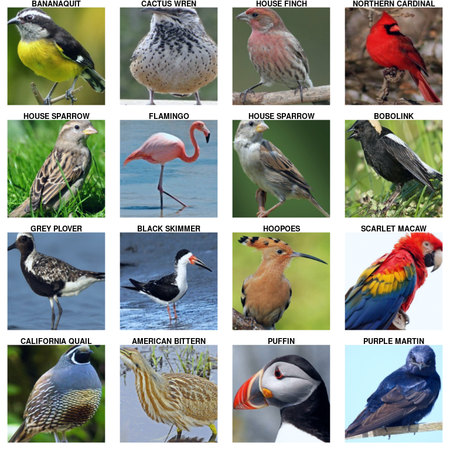

# Classifying images {#image_classification}

Our image classification example will differentiate ... not dogs and cats, not different dog breeds, but ...different species
of birds. We start from a model pretrained on [ImageNet](http://www.image-net.org/), which contains abundantly many photos of
birds (and other animals you wouldn't know even existed).

Concretely, for the pretrained model we'll use a Resnet, one of several classic computer vision models provided by
`torchvision`, and attach our own classification layer on top. If you are looking for how to code a convolutional neural
network from scratch, you can pick up related information in the following chapter on image segmentation, as well as that on
generative adversarial networks GANs).

## Data loading and transformation

The example dataset used here is available on Kaggle (<https://www.kaggle.com/gpiosenka/100-bird-species/data>). It is very
"un-noisy", which is why, the number of classes notwithstanding (130!), accuracy will turn out to be very good.

```{python}
import torch
import numpy as np
import torchvision
from torchvision import transforms, datasets, models
import os
```

```{python}
# https://www.kaggle.com/gpiosenka/100-bird-species/data
data_dir = 'data/bird_species'
```

The data set being so clean, we'll want to introduce random noise (*data augmentation*) on the training set to enhance model
resiliency.

In torchvision, data augmentation steps are added as part of an *image processing pipeline* that also takes care of resizing /
cropping images, converting them to torch tensors, and possibly, normalizing them according to the model's expectations. Here
they are, deterministic on validation and test sets, but including random components for the training set:

```{python}
data_transforms = {
    'train': transforms.Compose([
        transforms.RandomResizedCrop(224),
        transforms.ColorJitter(),
        transforms.RandomHorizontalFlip(),
        transforms.ToTensor(),
        transforms.Normalize([0.485, 0.456, 0.406], [0.229, 0.224, 0.225])
    ]),
    'valid': transforms.Compose([
        transforms.Resize(256),
        transforms.CenterCrop(224),
        transforms.ToTensor(),
        transforms.Normalize([0.485, 0.456, 0.406], [0.229, 0.224, 0.225])
    ]),
    'test': transforms.Compose([
        transforms.Resize(256),
        transforms.CenterCrop(224),
        transforms.ToTensor(),
        transforms.Normalize([0.485, 0.456, 0.406], [0.229, 0.224, 0.225])
    ]),
}

data_transforms
```

`ImageFolder` is a subtype of dataset that encapsulates information about where the images reside, and what transformations to
apply. Here, we create such a dataset for each of training, validation and test set:

```{python}
image_datasets = {x: datasets.ImageFolder(os.path.join(data_dir, x),
                                          data_transforms[x])
                  for x in ['train', 'valid', 'test']}
image_datasets
```

`ImageFolder` objects expect the different classes of images to reside each in their own folder. In our example, this is in
fact the case; for example, here is the directory layout for the first three classes in the test set:

    data/test/ALBATROSS/
     - data/test/ALBATROSS/1.jpg
     - data/test/ALBATROSS/2.jpg
     - data/test/ALBATROSS/3.jpg
     - data/test/ALBATROSS/4.jpg
     - data/test/ALBATROSS/5.jpg
     
    data/test/'ALEXANDRINE PARAKEET'/
     - data/test/'ALEXANDRINE PARAKEET'/1.jpg
     - data/test/'ALEXANDRINE PARAKEET'/2.jpg
     - data/test/'ALEXANDRINE PARAKEET'/3.jpg
     - data/test/'ALEXANDRINE PARAKEET'/4.jpg
     - data/test/'ALEXANDRINE PARAKEET'/5.jpg
     
     data/test/'AMERICAN BITTERN'/
     - data/test/'AMERICAN BITTERN'/1.jpg
     - data/test/'AMERICAN BITTERN'/2.jpg
     - data/test/'AMERICAN BITTERN'/3.jpg
     - data/test/'AMERICAN BITTERN'/4.jpg
     - data/test/'AMERICAN BITTERN'/5.jpg

From those specifications, `DataLoaders` are created. These objects, in addition to what to load and which transformations to
apply, know things like: many items to load in a batch, whether they should be shuffled, and whether to parallelize the
transformations.

```{python}
dataloaders = {x: torch.utils.data.DataLoader(image_datasets[x], batch_size=16,
                                             shuffle=True, num_workers=8)
              for x in ['train', 'valid', 'test']}
dataloaders
```

How many items are there in each set?

```{python}
dataset_sizes = {x: len(image_datasets[x]) for x in ['train', 'valid', 'test']}
dataset_sizes
```

Datasets know what classes there are:

```{python}
class_names = image_datasets['train'].classes
class_names
```

Next, let's view a few images from the test set. We can retrieve the first batch -- images and corresponding classes -- by
calling `next()` on a dataset's iterator:

```{python}
inputs, classes = next(iter(dataloaders['test']))
inputs.shape
```

The classes are integers, to be used as indexes into the vector of class names:

```{python}
classes
```

`toTensor()` converts images to tensors of shape `num_channels x height x width`

```{python}
inputs[0].shape
```

-- which means that for plotting using `as.raster`, we need to reshape images such that channels come last.

```{r, fig.asp = 1, fig.width = 8}
library(reticulate)
library(dplyr)

index <- 1:16
images <- py$inputs$numpy()[index,,,] %>% 
  aperm(perm = c(1, 3, 4, 2))
mean <- c(0.485, 0.456, 0.406)
std <- c(0.229, 0.224, 0.225)
images <- std * images + mean
images <- images * 255
images[images > 255] <- 255
images[images < 0] <- 0

par(mfcol = c(4,4), mar = rep(1, 4))

images %>%
  purrr::array_tree(1) %>%
  purrr::set_names(py$class_names[py$classes$numpy()[index] + 1]) %>%
  purrr::map(as.raster, max = 255) %>%
  purrr::iwalk(~{plot(.x); title(.y)})
```

```{r}

```

## Model

The backbone of our model is a pre-trained instance of Resnet.

```{python}
model = models.resnet18(pretrained=True)
model
```

We will modify the model's output layer to distinguish between our 130 bird classes, instead of the 1000 ImageNet classes it
was trained for. This means we only need to train a single layer -- the one we're going to add. We *could* perform
backpropagation through the complete model, trying to fine-tune Resnet's weights as well, but that would have a significant
effect on training time. (Alternatively, we could try to fine-tune just a few of Resnet's weights, those located iin the
layers directly preceding the output -- you might want to experiment with this at home.)

```{python}
for param in model.parameters():
    param.requires_grad = False
```

To replace the output layer, the model is just modified in-place:

```{python}
num_features = model.fc.in_features

model.fc = torch.nn.Linear(num_features, len(class_names))
```

## Training

For training, we use cross entropy loss and stochastic gradient descent.

```{python}
criterion = torch.nn.CrossEntropyLoss()

optimizer = torch.optim.SGD(model.parameters(), lr=1e-1)
```

We set the learning rate to 0.1, but that was just a formality. As became widely known to [fast.ai's deep learning
lectures](), it always makes sense to spend some time upfront to determine a good learning rate, and then during training,
evolve the learning rate according to some proven algorithm. While out-of-the-box, torch does not provide a tool like
fast.ai's learning rate finder, the logic is straightforward to implement, and sample code is given on Sylvain Gugger's blog.
Algorithms like one-cycle learning [@abs-1708-07120], cyclical learning rates [@Smith15a], or cosine annealing with warm
restarts [@LoshchilovH16a] are, however, implemented in torch, and we'll make use of `lr_scheduler.OneCycleLR` once we've
determined an appropriate value for the required parameter `max_lr`.

Here is how to find a good learning rate, from [Sylvain
Gugger](https://sgugger.github.io/how-do-you-find-a-good-learning-rate.html):

```{python}
# from: https://sgugger.github.io/how-do-you-find-a-good-learning-rate.html

import math

def find_lr(init_value = 1e-8, final_value=10., beta = 0.98):
    num = len(dataloaders['train'])-1
    mult = (final_value / init_value) ** (1/num)
    lr = init_value
    optimizer.param_groups[0]['lr'] = lr
    avg_loss = 0.
    best_loss = 0.
    batch_num = 0
    losses = []
    log_lrs = []
    for data in dataloaders['train']:
        batch_num += 1
        #As before, get the loss for this mini-batch of inputs/outputs
        inputs,labels = data
        optimizer.zero_grad()
        outputs = model(inputs)
        loss = criterion(outputs, labels)
        #Compute the smoothed loss
        avg_loss = beta * avg_loss + (1-beta) *loss.item()
        smoothed_loss = avg_loss / (1 - beta**batch_num)
        #Stop if the loss is exploding
        if batch_num > 1 and smoothed_loss > 4 * best_loss:
            return log_lrs, losses
        #Record the best loss
        if smoothed_loss < best_loss or batch_num==1:
            best_loss = smoothed_loss
        #Store the values
        losses.append(smoothed_loss)
        log_lrs.append(math.log10(lr))
        #Do the SGD step
        loss.backward()
        optimizer.step()
        #Update the lr for the next step
        lr *= mult
        optimizer.param_groups[0]['lr'] = lr
    return log_lrs, losses
    
logs,losses = find_lr()
```

```{r}
df = data.frame(logs = py$logs[10:(length(py$logs) - 5)], losses = py$losses[10:(length(py$losses) - 5)])

library(ggplot2)
ggplot(df, aes(logs, losses)) + geom_point()
```

The best learning rate is not the exact one where loss is at a minimum, instead, it should be picked somewhat earlier on the
curve, while loss still decreases. We'll try 0.05 here.

`OneCycleLR` will then vary the learning rate continuously, performing just a single ramp-up and a single ramp-down over the
whole training period:

```{python}
num_epochs = 10
lr_scheduler = torch.optim.lr_scheduler.OneCycleLR(optimizer, max_lr = 0.05, epochs = num_epochs, steps_per_epoch=len(dataloaders['train']))
```

Now we train for ten epochs. In every epoch, we iterate over both training and validation sets; performing optimization on the
training set while just calculating accuracy on the test set. Note that `lr_scheduler.step()` has to be called explicitly
after each batch, and it has to be called *after* `optimizer.step()`.

```{python}

device = torch.device("cuda:0" if torch.cuda.is_available() else "cpu")
model = model.to(device)

for epoch in range(num_epochs):

        print('Epoch {}/{}'.format(epoch, num_epochs - 1))
        print('-' * 10)
        
        for phase in ['train', 'valid']:
        
            if phase == 'train':
                model.train() 
            else:
                model.eval()   
            running_loss = 0.0
            running_num_correct = 0
            
            for inputs, labels in dataloaders[phase]:
                inputs = inputs.to(device)
                labels = labels.to(device)
                
                optimizer.zero_grad()
                
                with torch.set_grad_enabled(phase == 'train'):
                    outputs = model(inputs)
                    _, preds = torch.max(outputs, 1)
                    loss = criterion(outputs, labels)
                    
                    if phase == 'train':
                        loss.backward()
                        optimizer.step()
                        lr_scheduler.step()
                        
                running_loss += loss.item() * inputs.size(0)
                running_num_correct += torch.sum(preds == labels.data)
                
            epoch_loss = running_loss / dataset_sizes[phase]
            epoch_acc = running_num_correct.double() / dataset_sizes[phase]
            print('{} Loss: {:.4f} Acc: {:.4f}'.format(
                phase, epoch_loss, epoch_acc))
        print()
```

## Performance on the test set

Finally, we calculate accuracy on the test set:

```{python}
phase = 'test'
with torch.no_grad():
        running_num_correct = 0
        for inputs, labels in dataloaders[phase]:
            inputs = inputs.to(device)
            labels = labels.to(device)
            outputs = model(inputs)
            _, preds = torch.max(outputs, 1)
            running_num_correct += torch.sum(preds == labels.data)
        print('test accuracy: {:4f}'.format(running_num_correct.double()/ dataset_sizes[phase]))
```
